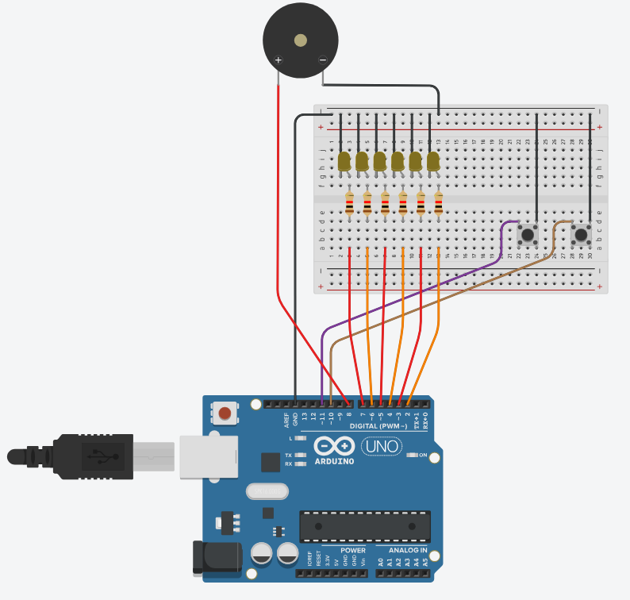

# Modern Car Blinker with Arduino

This project simulates a modern car blinker system using an Arduino. It features sequential LED animations for both left and right turn signals, a buzzer for realistic blinker sounds, and button controls for activation. The system ensures that only one blinker is active at a time, mimicking real automotive behavior.

## Features
- **Sequential LED animation** for left and right turn signals.
- **Realistic blinker sound** using a buzzer.
- **Button-controlled activation** for both blinkers.
- **Automatic toggle system** to prevent both blinkers from running simultaneously.

## Components
- **Arduino Board** (Uno, Mega, or compatible)
- **6 LEDs** (for sequential signaling)
- **Resistors** (220Ω for each LED)
- **Buzzer/Speaker**
- **2 Push Buttons** (for left and right blinker control)
- **Jumper Wires**

## Pinout
| Component     | Arduino Pin |
|--------------|------------|
| LED 1        | 7          |
| LED 2        | 6          |
| LED 3        | 5          |
| LED 4        | 4          |
| LED 5        | 3          |
| LED 6        | 2          |
| Speaker      | 8          |
| Left Button  | 11         |
| Right Button | 10         |

## Wiring
1. Connect each LED to its corresponding pin with a 220Ω resistor.
2. Connect the speaker's positive terminal to pin **8** and the negative terminal to **GND**.
3. Connect the left button between pin **11** and **GND**, using **INPUT_PULLUP** mode.
4. Connect the right button between pin **10** and **GND**, using **INPUT_PULLUP** mode.

## Schematic
Below is a schematic diagram for the wiring of the modern car blinker system.  

  

> **Note:** Replace `schematic.png` with the actual filename of your schematic image. Ensure the image is placed in the root directory of your repository.

## Code
Upload the provided Arduino sketch to your board. The code handles:
- **Blinker sequencing** with a delay to simulate modern car indicators.
- **Sound effects** using `tone()` for a more realistic experience.
- **Button toggling logic** to enable or disable blinkers.

## Usage
- **Press the left button** to activate the left blinker. Press again to turn it off.
- **Press the right button** to activate the right blinker. Press again to turn it off.

